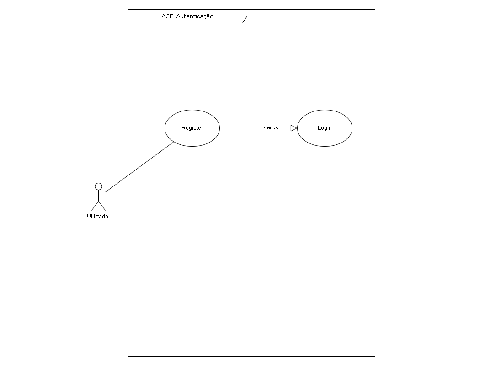
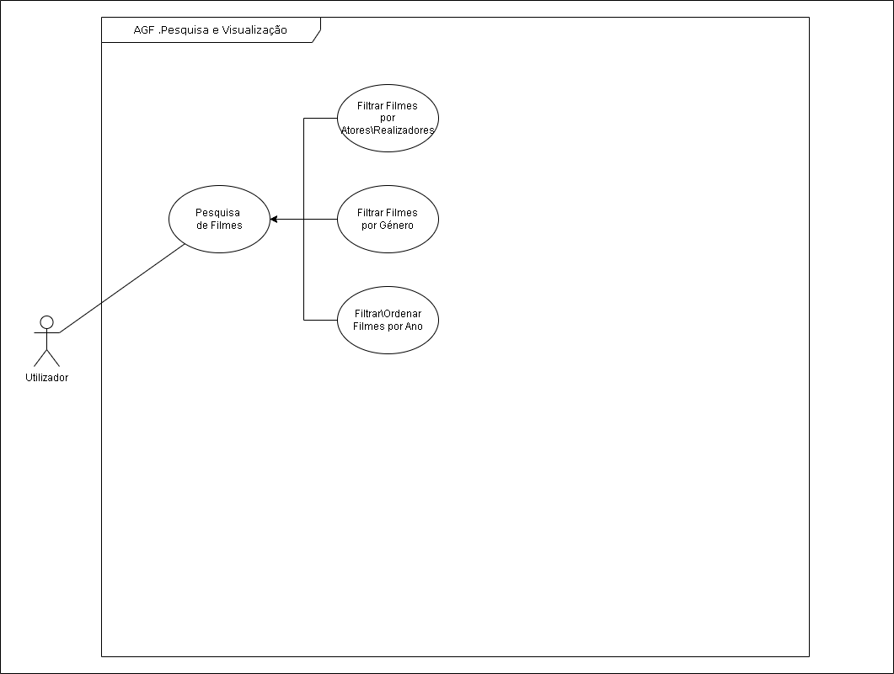
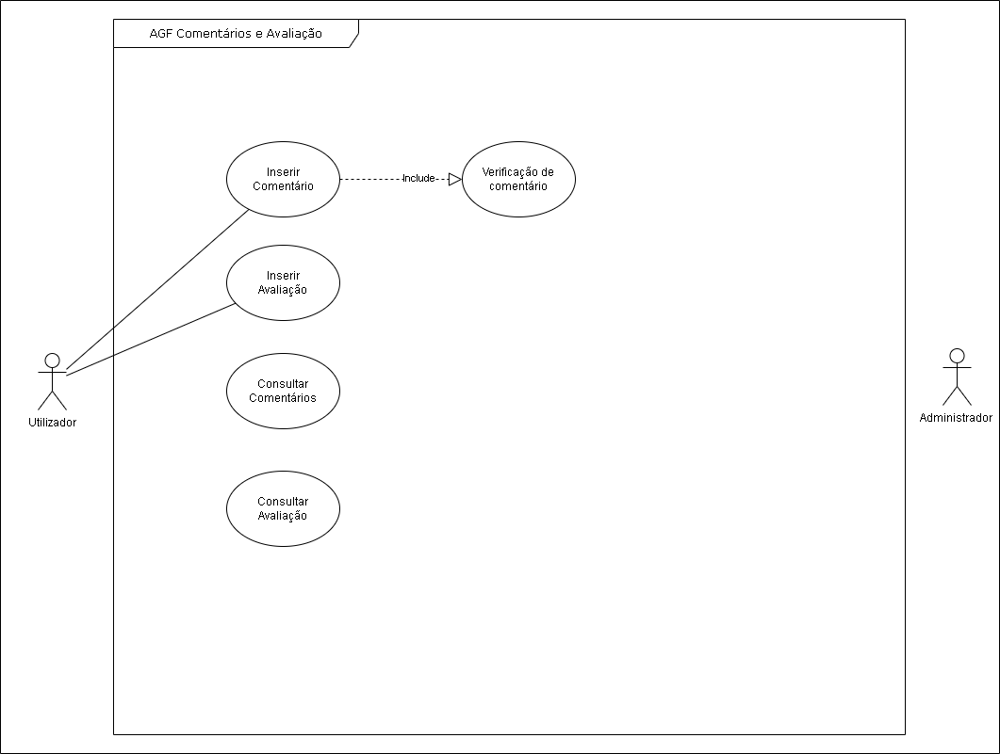

# Índice
[1 - Requisitos apresentados](#1---Requisitos-apresentados) 
[2 - Metodologia de trabalho](#2---Metodologia-de-trabalho) 
[3 - Casos de teste considerados](#3---Casos-de-teste-considerados) 
[4 - Diagrama de Use Case](#4---Diagrama-de-Use-Case) 
4.1 - Autenticação 
4.2 - Pesquisa e visualização 
4.3 - Comentário e avaliação 
[5 - Diagrama de atividades](#5---Diagrama-de-atividades) 

## 1 - Requisitos apresentados 

- Login e registo
Email e password
(Permitir registar caso não existe inserindo tambem o nome)

### Requisitos do Cliente ou requisitos funcionais
Webbrowser
Num pc tablet ou smartphone
responsivo

- Permite visualizar resumos de filmes

1 - Requisitos do Sistema 
- Apresentação do sistema que se pretende criar 
- descrição dos requisitos/necessidades que o mesmo visa suprir em termos de gestão de dados (em formato textual);

O nosso projeto tem as seguintes especificações:
- Permitir fazer um login para cada utilizador
- Cada utilizador pode ter uma ou mais lista de filmes umas podem ser personalizadas (pode atribuir o nome da lista), ou predefinidas (Favoritos, Não Gosto, Quero Ver)

- Permite inserir um filme com o Título, Ano e Idioma
- Permite atribuir um ou mais géneros ao filme
- Permite inserir ou escolher o(s) realizador(es)
- Permite inserir ou escolher o(s) ator(es)
- Permite cada utilizador avaliar (dar pontuação) de 0 a 10 a cada um dos filmes e atribuir também um comentário.
- 
2 - Requisitos do Sistema- Necessidades de informação que se pretende extrair dos dados (em forma textual);
A informação que pretendemos do nosso projeto é a seguinte:
- O top 10 filmes de cada pessoa em termos de pontuação
- O top 10 filmes de todos utilizadores em termos de pontuação
- Permite ver os últimos 10 filmes consultados pelo utilizador
- Permite ver os últimos 10 filmes mais consultados pelos utilizadores todos
- Permite visualizar cada uma das listas do utilizador

### Requisitos de Arquitetura
- Vamos adoptar por uma solução cloud.
- Vamos fazer um estudo comparativo em termos de custos 
- funcionalidades da Amazon AWS, Microsoft Azure, da Google Cloud Platform e da Heroku Platform.
- Implica fazer o outsourcing e delegação de responsabilidades de manutenção do hardware, de backups e permite-nos num futuro, fazer facilmente o upgrade da infraestrutura.
- Em termos de custos significa que não temos que fazer um investimento volumoso inicial, sendo este diluído ao longo do tempo e permite uma maior flexibilidade em termos de crescimento futuro.

- Base de dados um container com o Sistema Operativo para alojar a aplicação

### Requisitos Estruturais  
Como optamos solução cloud não necessitamos de infraestrutura própria

### Requisitos de Comportamento  
- É necessário entender o comportamento esperado dos sistemas para evitar falhas ou erros.
- A complexidade dos sistemas e dos mecanismos de implementação de comportamento esperado, visa saber como responder quando for necessária intervenção externa. 
- Por este motivo, precisamos de conhecer os meios para visualizá-los, assim como as métricas de alto nível que conseguem sistematizar os dados. 

### Requisitos Funcionais  
- Descrevem explicitamente as funcionalidades e serviços do sistema. 
- Todos os serviços devem estar bem definidos, não apresentando valores contraditórios 
- O utilizador pode pesquisar tudo ou um subconjunto do banco de dados
- O sistema deve oferecer ecrãs apropriados para o utilizador ler os documentos armazenados  

### Requisitos de Performance  
- Já a performance é o conjunto de medidas de desempenho, normalmente relacionadas ao tempo de resposta do sistema ao executar as requisições dos clientes.
- Algumas aplicações exigem alta capacidade de processamento, conhecida como alta performance ou alto desempenho.
- O foco da alta performance é trazer resultados satisfatórios em tempo útil, mesmo que haja uma variedade enorme de instruções a serem executadas por segundo. 
- Os valores e as métricas para avaliar a performance estão relacionados aos requisitos do sistema.
- 
### Requisitos de Design  
- Ajuda a ampliar pequenos detalhes essenciais ao projeto, permitindo pensar os componentes individualmente.

**Simplicidade, 
pretende-se garantir uma certa simplicidade nos modelos apresentados, sem fugir ao que o cliente solicita,
## Modularidade, 
segue o principio da construção de sistemas individuais ou por módulos, que poderão ou não ser integrados e funcionarem como um todo,
## Integridade, 
preservação, concistência e confiabilidade das informações e sistemas pela empresa
## Antecipar mudanças, 
que se vão alterando de acordo com as mudanças do ambiente ao qual a organização está operando;
## Abstração,
## Alterações,
### Contolo de versões,  
O controlo de versões é a comparação ou gestão de várias versões de um software ou de outro tipo de dados, em que são tribuídos de forma crescente e indicam o desenvolvimento de melhoria.

## 2 Metodologia
Felício
A metodologia selecionada é o Scrum.

Cópia do powerpoint:
● Ótimo para projetos longos devido à flexibilidade nas alterações e no 
constante feedback da parte do cliente
● Separação do ciclo de desenvolvimento em “sprints” que tornam o processo 
mais rápido e segmentado
● Foco maior na qualidade do produto final
● Possível testar em qualquer fase
● Altamente cooperativo

 

## 3 - Casos de teste considerados 

### Funcionalidades  
- Navegar pela aplicação
- Pesquisar por vários filmes
- Avaliar vários filmes
- Comentar vários filmes
- Criar várias listas

### Confiabilidade  
- Tentar navegar no site sem login feito
- Tentar avaliar vários filmes sem login feito
- Tentar comentar vários filmes sem login feito
- Tentar criar listas sem login feito
- Apagar listas e verificar se foram mesmo apagadas
- Mandar o servidor a baixo enquanto se usa alguma funcionalidade e verificar se os dados foram apagados ou gravados
- Apagar a conta e verificar se as avaliações se mantém na média
- Apagar a conta e verificar se os comentários antigos permanecem

### Usabilidade  
- Sem explicar a aplicação, pedir a outras pessoas para navegarem na aplicação
- Clicar nos botões e links e verificar se os mesmos enviam-nos para a pagina que o nome se refere
- Analisar o nome das funcionalidades (nome dos botões por exemplo) e refletir se são auto-explicativos ou não

### Eficiência  
- Efetuar o login e refletir sobre o tempo de espera para responder
- Navegar no site e retirar o tempo de resposta de cada ação (Scroll-down, Clicar num filme, clicar num botão, etc...)
- Analisar quanto tempo a aplicação demora a postar um comentário
- Analisar quanto tempo demora para a aplicação efetuar o calculo da média de um filme após muitas avaliações
- Criar lista e analisar o tempo de resposta para cada filme ser adicionado
- Apagar várias listas, de pequenas com 1 filme a grandes com 50 filmes e verificar se o tempo de resposta é igual

### Portabilidade  
- Testar a aplicação em Windows
- Testar a aplicação em Linux
- Testar a aplicação em MacOS
- Mudar o dominio (link de acessebilidade) do site
- Testar o download da aplicação
- Conformidade de acordo com as normas, convenções, guias de estilo ou regulamentações

### Manutenibilidade (Com dados na base de dados)  
- Testar um a atualização e verificar se tudo feito anteriormente continua salvo
- Encerrar o servidor por um tempo e verificar se transmite a mensagem de manutenção aos utilizadores/visitantes
- verificar se o servidor volta no tempo previsto com as atualizações

### White-Box (Acesso total ao codigo)  
- Testar a vulnerabilidade do codigo referente a vazamento de informações
- Testar a segurança de forma rigorosa
- Visualizar o site/app por monitores de várias dimensões e ver se é totalmente responsivo
- Testar loops para verificar se são funcionais e não infinitos
- Teste de cada intrução, objeto e função individualmente

### Black-Box (Analisar os requesitos e especificações do sistema primeiro) 
- Analisar as entradas com cenários positivos e verificar se o sistema processa corretamente
- Analisar as entradas com cenários negativos e verificar se o sistema as detecta
- Testes funcionais
- Testes não funcionais
- Testes de regressão (Após correção de algum bug, testar novamente)

### Gray-Box (Acesso parcial ao codigo)  
- Explorar a informação dada
- Testar um mix de white-box e Black-box com essa informação e ver as falhas de segurança
- Testar os niveis de permissões de diferentes usuarios ficticios (Com estatutos diferentes)

### Unit (Correção do codigo (Estrutura))  
- Mocha.js
- Puppeteer
- Jasmine

### Testes de integração  
- Analisar as compatibilidades ou as faltas dela com o site/app num todo
- Verificar a comunicação dos modulos
- Testar as funcionalidades juntas
- Verificr as validações

### Testes de carga  
- Enviar vários logs ao mesmo tempo
- Com VPN ou várias pessoas remotamente testar o volume de trafego noutros paises
- Analisar se há limite de criação de usuarios
- Analisar se há limite de ratings por hora
- Analisar se há limite de listas

## 4 - Diagrama de Use Case 

### 4.1 - Autenticação 

### 4.2 - Pesquisa e visualização 

### 4.3 - Comentário e avaliação 

| Fase               | Descrição                                               |
| ------------------ | ------------------------------------------------------- |
| Pré-Condição       | 1. O utilizador deve estar autenticado                  |
|                    | 2. O utilizador deve ter escolhido um filme,            |
|                    |    e estar na respetiva página de visualização          |
|                    |    dococumento.                                         |
|                    | 3. Deve existir um código de conduta de utilização      |
|                    |    do site                                              |
|                    |                                                         |
| Descrição          | 1. O utilizador pode inserir um texto de até 500        |
|                    |    caracteres                                           |
|                    | 2. O utilizador pode inserir uma avaliação              |
|                    |    com um valor de 0 a 10                               |
|                    | 3. O sistema deve de uma forma automática verificar     |
|                    |    se o texto do comentário não viola nenhuma regra     |
|                    |    do código de conduto de utilização do site           |
|                    | 4. O sistema deve permitir que qualquer utilizador      |
|                    |    denúncie comentários que contenham alguma forma de   |
|                    |    violação do código de conduta de utilização do site  |
|                    | 5. Em caso de deteção de violação de regras             |
|                    |    O administrador é alertado para tomar medidas        |
|                    |    que podem incluir a eliminação do comentário         |
|                    |    ou o bloqueamento da conta do user                   |
|                    |                                                         |
| Pós-Condição       |                                                         |
|                    |                                                         |
 

Carlos
## 5 - Diagrama de atividades 

